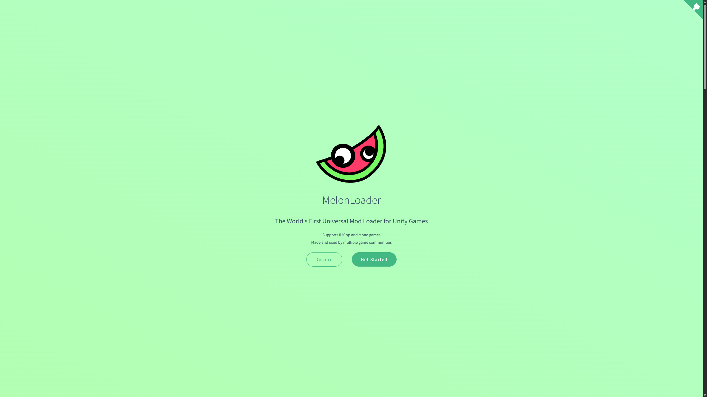
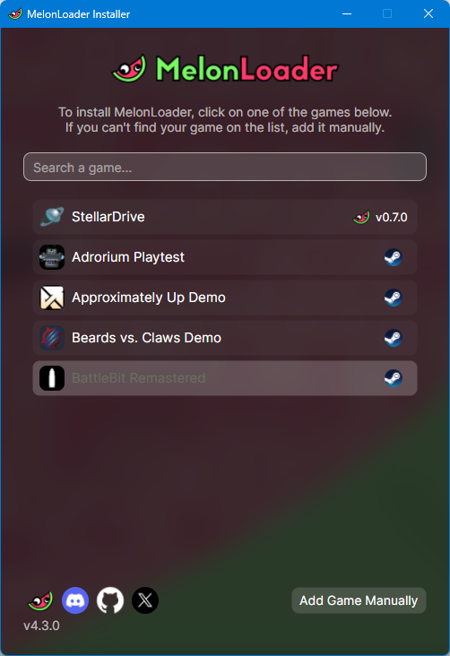
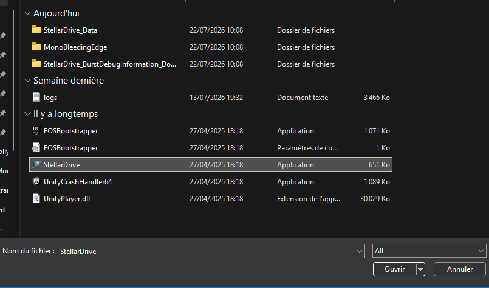
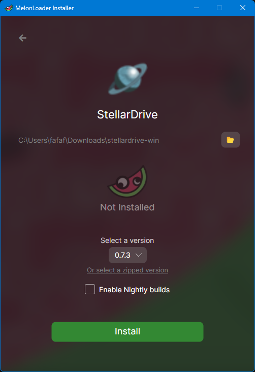
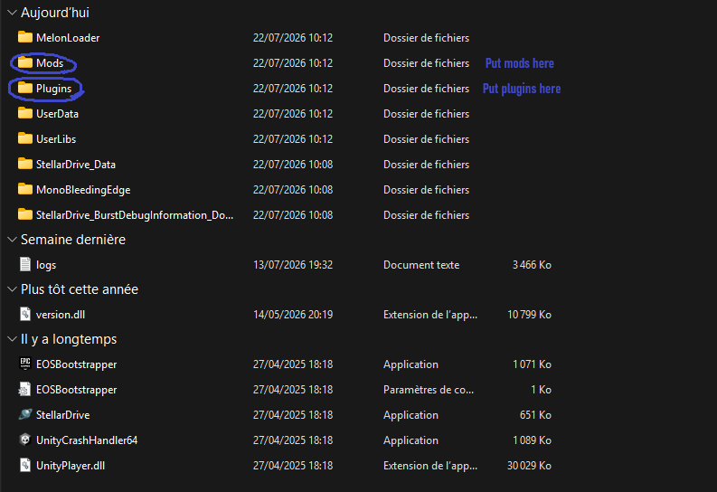

# Installing MelonLoader

MelonLoader is the mod loader used by StellarDrive. Whether you want to create mods or simply use them, you'll need to install MelonLoader first.

## Downloading MelonLoader

Download the MelonLoader installer: [MelonLoader](https://melonwiki.xyz/#/){ target="_blank" }

## Installing

1. Run the installer. It should look similar to the screenshot below (the list of installed games may differ).

    

    !!! note

        If you own StellarDrive on itch.io, it won't appear automatically in the installer. Click **Add Game Manually** in the bottom-right corner and select your `StellarDrive.exe`.

    

2. Press the **Install** button.

    

3. Verify the installation.

    After the installation is complete, your StellarDrive folder should contain the following directories:

    

    !!! tip

        If the `Mods` or `Plugins` folder is missing, you can create it manually by creating a folder with the same name.

## Next Step

MelonLoader is now installed. Continue by creating your first StellarDrive mod:

[Creating Your First Mod](creating-your-first-mod.md)